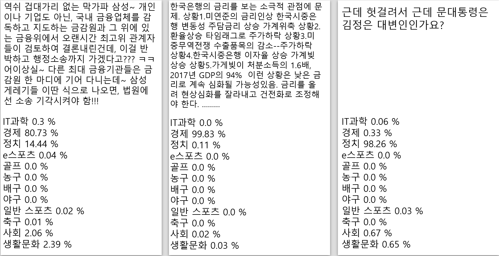

# 필요 패키지
* konlpy: https://hyrama.com/?p=456
* gensim: https://hyrama.com/?p=456

# 사용법
* CsvWord2Vec.py을 이용하여 자신만의 데이터를 임베딩 하세요
* Classifier.py를 실행하여 문장을 입력하면 카테고리를 분석해줍니다.
* Classifier.py 및 CsvWord2Vec.py를 실행하기 전에 여러 파일들의 경로들을 잘 확인하신 후 경로를 재설정 해주시기 바랍니다.

# 결과물

# HELP
* https://github.com/MSWon/Sentimental-Analysis
